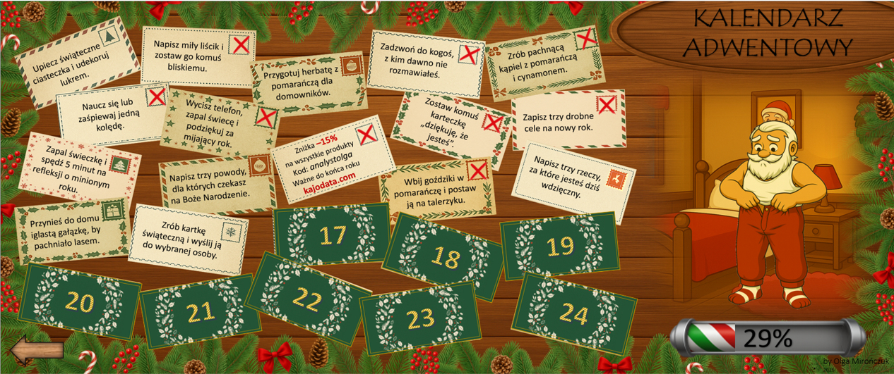

# 🎄 Kalendarz Adwentowy 2025 (Excel + VBA)

Autorski projekt kalendarza adwentowego w Excelu, zaprojektowany jako mini‑aplikacja działająca lokalnie, a nie klasyczny arkusz kalkulacyjny.

Projekt powstał z myślą o zabawie i interakcji użytkownika w okresie świątecznym, ale od strony technicznej został zbudowany jak spójny system: z trwałym stanem, regułami czasowymi i warstwą logiki oddzieloną od interfejsu.

<p align="center">
  
</p>

---

## Cel projektu

- stworzenie interaktywnego kalendarza adwentowego działającego offline  
- zaprojektowanie logiki reagującej na datę, postęp i działania użytkownika  
- trwałe zapisywanie stanu aplikacji  
- pokazanie możliwości Excela i VBA jako środowiska do budowy prostych aplikacji  

Projekt był udostępniany użytkownikom w formie świątecznej zabawy.  
Po zakończeniu kalendarza repozytorium zostało uzupełnione o pełną dokumentację techniczną.

---

## Jak to działa (w skrócie)

- użytkownik otwiera kolejne dni przez kliknięcie elementów interfejsu  
- dostępność okienek zależy od daty i zdefiniowanych reguł  
- zatwierdzenie zadania zapisuje trwały stan w tabeli sterującej  
- interfejs jest dynamicznie aktualizowany przez VBA  
- całość działa lokalnie, bez połączenia z internetem  

<p align="center">
  
</p>

<p align="center">
  
</p>

---

## Struktura projektu

```
├── code/vba/
│   ├─ RUNNER.bas
│   ├─ OdwrocKarte.bas
│   ├─ NaklejanieZnaczka.bas
│   ├─ ZnakX.bas
│   ├─ ObrazMikolaja.bas
│   ├─ StartFinalu.bas
│   ├─ OknoKoncowe.bas
│   └─ ThisWorkbook.cls
│
├── docs/
│   ├─ README_no_spoilers.md
│   ├─ architecture.md
│   └─ modules.md
│   
├── img/
│   ├─ screen.png
│   ├─ screen1.png
│   └─ wlasciwosci.png
│   
└── README.md

```

Szczegółowy opis architektury i modułów znajduje się w folderze `docs`.

---

## Dokumentacja techniczna

- `docs/architecture.md` – architektura i przepływ logiki  
- `docs/modules.md` – opis modułów VBA  
- `docs/README_no_spoilers.md` – wersja README udostępniana użytkownikom  

---

## Stan aplikacji

Trwały stan aplikacji przechowywany jest w arkuszu kontrolnym **„tajne zapiski elfów”**.  
Arkusz ten był ukryty i niedostępny dla użytkownika końcowego w trakcie działania kalendarza i pełni wyłącznie funkcję techniczną.

---

## Rola AI w projekcie

W projekcie korzystałam z AI jako narzędzia wspierającego pracę koncepcyjną i iteracyjną nad rozwiązaniami w VBA.

Po mojej stronie było:
- zaprojektowanie logiki aplikacji  
- decyzje architektoniczne  
- testowanie zachowania w Excelu  
- doprowadzenie całości do stabilnego, przewidywalnego efektu  

---

## Informacje końcowe

Projekt ma charakter autorski i portfolio.  
Repozytorium prezentuje zarówno efekt końcowy, jak i sposób myślenia projektowego.
