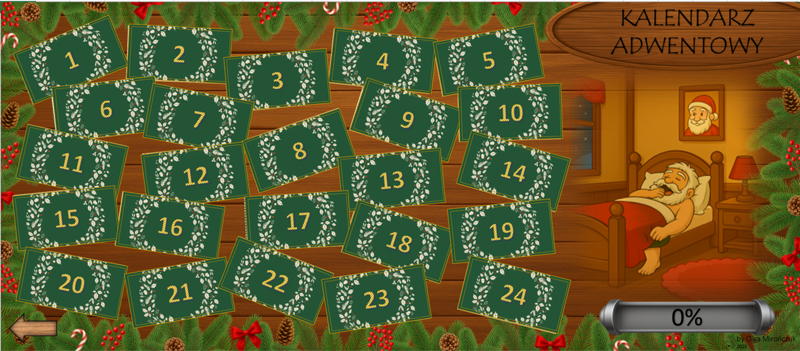

# 🎄 Kalendarz Adwentowy 2025

Grudzień to dla mnie wyjątkowy czas. Już początkiem miesiąca nasze mieszkanie zaczyna pachnieć pomarańczą i świerkiem. Wystrój zmienia się w czerwono-zielony, a w oknach połyskują ciepłe światełka. Uwielbiam budować świąteczny klimat nie tylko we własnym domu. Z tej miłości do świąt powstał **Kalendarz Adwentowy 2025**, stworzony po to, by każdego dnia przypomnieć nam o drobnych, prostych rzeczach, które naprawdę budują atmosferę Bożego Narodzenia.  

> **Uwaga:** kalendarz zaczyna działać **1 grudnia** - wcześniej okienka są celowo nieaktywne.

Nie znajdziesz tu wykresów ani tabel. Zamiast tego czekają na Ciebie **24 świąteczne okienka z zadaniami**, które pomogą Ci wejść w grudniowy nastrój. 🎅  

  

---

## 📦 Co znajdziesz w środku

- 24 pocztówki/okienka ze świątecznymi zadaniami do wykonania.  
- Na każde zadanie masz **3 dni** (np. zadanie z 1 grudnia możesz wykonać najpóźniej 3 grudnia; **4 grudnia** okienko zostanie zablokowane).  
- Tym samym wykonanie ostatniego zadania zablokuje się **27 grudnia**, a nie 24.  
- Aby zatwierdzić wykonanie, należy **„nakleić znaczek”** klikając na wyznaczone miejsce.  
  Uwaga! Naklejonego znaczka **nie da się odkleić**! Elfy zadbały o mocny klej!
  
> ## 🎁 Specjalna niespodzianka
> Projekt powstał we współpracy z **[KajoData](https://kajodata.com)** - marką, której zaufały tysiące osób uczących się analizy danych.  
> Na jednej z pocztówek znajdziesz **ukryty kod rabatowy -15%** na wszystkie produkty KajoData.  
> Świąteczny prezent dla tych, którzy lubią łączyć naukę z odrobiną magii. 

  

---

## ⬇️ Pobierz kalendarz

👉 [**Kliknij tutaj, aby pobrać plik KalendarzAdwnetowy_2025_by_Olga_Mironczuk_x_KajoData**](https://github.com/Waderlla/KalendarzAdwnetowy_2025_by_Olga_x_KajoData/raw/refs/heads/main/KalendarzAdwnetowy_2025_by_Olga_Mironczuk_x_KajoData.xlsm?download=)

*(plik `.xlsm` - działa w Microsoft Excel, wersja desktopowa)*  
🔒 To **jedyny oficjalny i bezpieczny plik kalendarza**.  
Nie jest on publikowany ani udostępniany na żadnych innych stronach, forach czy serwisach z plikami.  
Pobieranie z innych źródeł może być ryzykowne.

---

## ✅ Wymagania i zgodność

- **Plik:** `.xlsm` (zawiera makra niezbędne do działania kalendarza)  
- **Program:** Microsoft Excel - **wersja desktopowa**  
  - Windows: Excel 2016 / 2019 / 2021 / Microsoft 365  
  - macOS: Excel 2019 / 2021 / Microsoft 365  
- **Nie działa w:** Excel Online, Google Sheets, innych edytorach arkuszy  

---

## Jak uruchomić kalendarz

### 1️⃣ Odblokuj plik (po pobraniu z internetu)

**Windows**
1. Zamknij Excel (jeśli jest otwarty).  
2. Kliknij plik prawym przyciskiem → **Właściwości**.  
3. Zaznacz **„Odblokuj”** → **Zastosuj** → **OK**.

  

**macOS**
1. Kliknij plik prawym przyciskiem → **Otwórz** (za pierwszym razem potwierdź uruchomienie),  
   albo wejdź w **Ustawienia systemowe → Prywatność i bezpieczeństwo** i zezwól na otwarcie tego pliku.

---

### 2️⃣ Włącz makra w Excelu

1. Otwórz plik w Excelu.  
2. U góry pojawi się żółty pasek z informacją o zabezpieczeniach - kliknij **„Włącz zawartość”** (*Enable Content*).  
3. Gotowe! Interaktywne funkcje kalendarza (otwieranie okienek, „naklejanie znaczków”, drobne animacje) będą działać.  

> 🧩 Makra służą wyłącznie do obsługi interfejsu kalendarza.  
> Plik działa lokalnie: **nie łączy się z internetem** i **nie pobiera żadnych danych**.  

---

## 🧡 Kilka słów ode mnie

Zawsze wierzyłam, że magia świąt tkwi w prostych gestach - w uśmiechu, zapachu pomarańczy, w tym, że ktoś pomyślał o Tobie choć przez chwilę. Dlatego stworzyłam ten kalendarz. Żebyś mógł na moment zwolnić, uśmiechnąć się i zrobić coś małego, co naprawdę ma znaczenie.  

Niech każdy dzień grudnia przyniesie Ci odrobinę ciepła i spokoju.  
Czasem wystarczy tylko jedno okienko. 💫  

Z serdecznymi pozdrowieniami,  
**Olga Mirończuk (Waderlla)**  

---

## 📽️ Dodatkowe materiały

Pełny opis techniczny projektu i kulisy jego powstawania pojawią się **27 grudnia 2025 r.**. Nie publikuję ich wcześniej, żeby nie zdradzać zawartości i nie odbierać radości odkrywania każdego okienka. 🎁  

---

## 📜 Licencja

Ten projekt jest objęty licencją **Creative Commons BY-NC-ND 4.0 International**.  
Można swobodnie **udostępniać link do tego repozytorium**.  
Nie wolno jednak **kopiować, modyfikować ani publikować pliku w innych miejscach**.  
Kalendarz jest przeznaczony do **użytku osobistego i niekomercyjnego**, z zachowaniem informacji o autorze.  

---

## 📨 Kontakt

Jeśli coś nie działa albo chcesz się podzielić wrażeniami, skontaktuj się ze mną przez  
📎 [LinkedIn](https://www.linkedin.com/in/olga-mironczuk-data/)  
📧 **olga.mironczuk.data@gmail.com**
